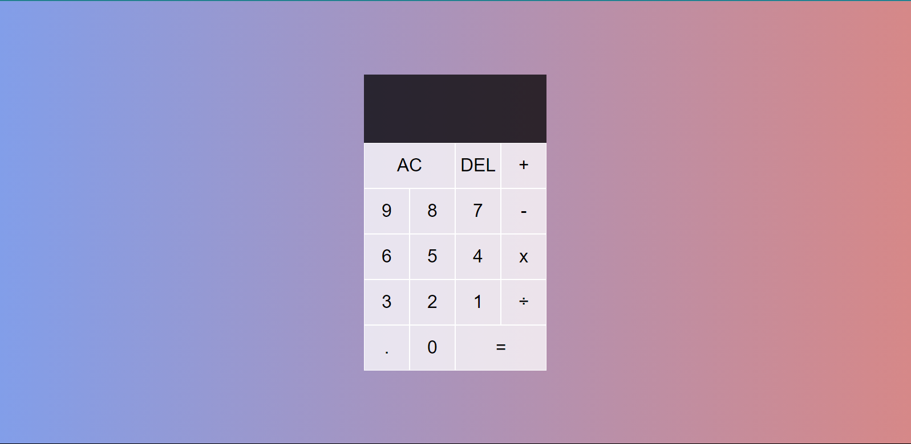

# My Calculator

</img>

## Try it Live!

Check out the live app [My Calculator]()

## Tools Used

-   JavaScript
-   HTML
-   CSS

## Getting Started

1. Clone this repository.

    ```bash
    git clone https://github.com/mahmoud-mohsen-dev/myCalculator.git
    ```

2. Navigate to the Project Directory:
    ```bash
    cd myCalculator
    ```
3. Development Server

    Run the project with Live server

    or just open `index.html` file on the browser

Now you have the "myCalculator" app up and running on your local machine.
